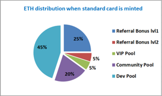

# ETH distribution when standard card is minted

&#x20;

On diagram you see the edge case assuming that user has refBonus=25%. If user has refBonus<25% then the rest will be added to the community pool. As a min possible value of refBonus=10% the community pool sometimes can get up to 35% of ETH from minted standard card.
